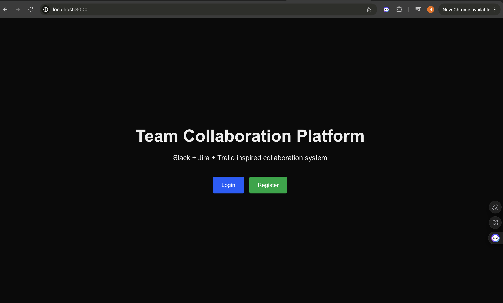
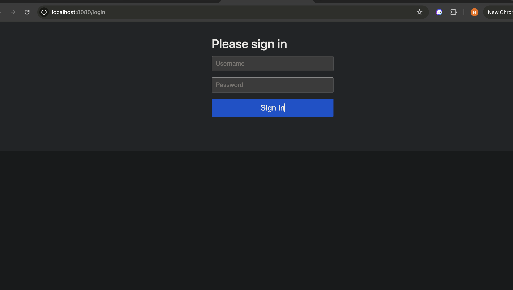
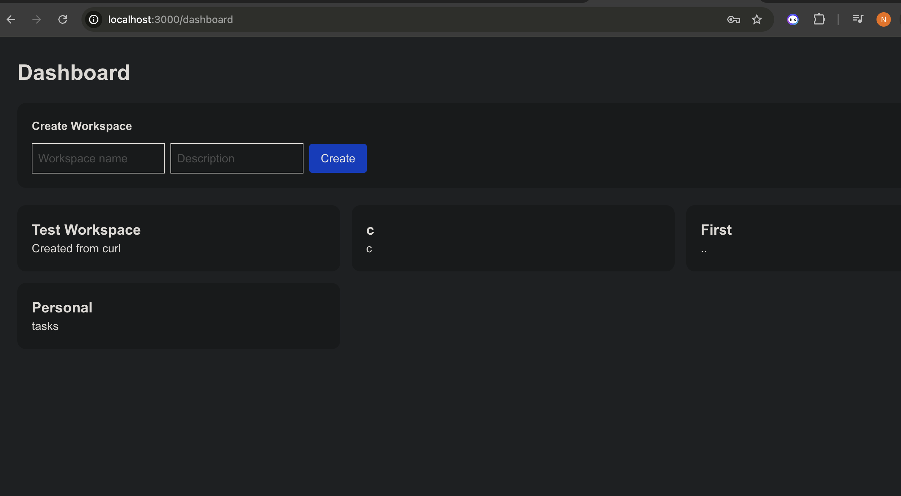
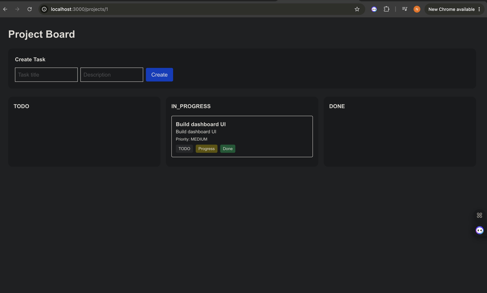
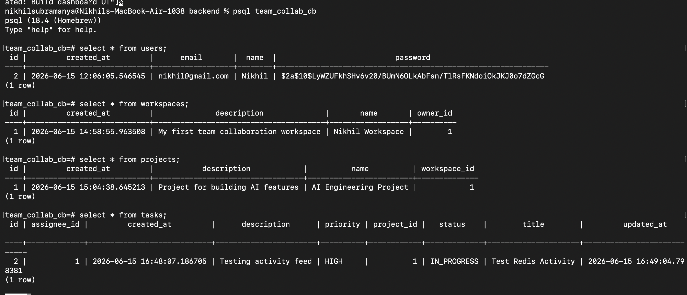
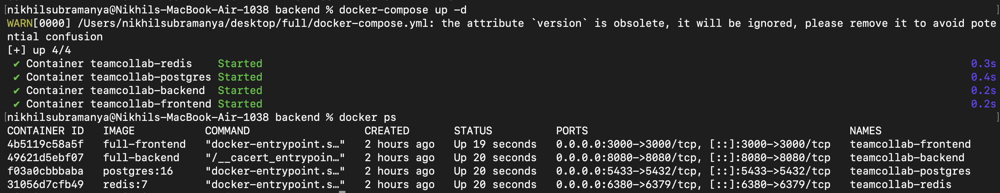

# Team Collaboration Platform

A production-style Team Collaboration Platform inspired by Jira, Trello, and Slack. The platform enables teams to create workspaces, manage projects, track tasks, collaborate through comments, upload files, and monitor activities in real time.

## Features

### Authentication & Security

* User Registration
* User Login
* Spring Security Integration

### Workspace Management

* Create Workspaces
* View Workspace Details
* Workspace Ownership Management

### Project Management

* Create Projects within Workspaces
* View Project Details
* Project Organization and Tracking

### Task Management

* Create Tasks
* Update Task Status
* Delete Tasks
* Task Tracking Workflow

### Collaboration Features

* Task Comments
* Real-Time Updates using WebSockets
* Activity Feed Tracking

### File Management

* Upload Files to Tasks
* View Uploaded Files
* File Metadata Storage

### Redis Integration

* Activity Feed Caching
* Recent Activity Tracking
* Event Logging

### Containerization

* Dockerized Backend
* Dockerized Frontend
* Docker Compose Setup
* PostgreSQL Container
* Redis Container

---

## Tech Stack

### Frontend

* Next.js
* React
* TypeScript

### Backend

* Spring Boot
* Spring Security
* Spring Data JPA
* WebSocket

### Database

* PostgreSQL

### Cache & Messaging

* Redis

### DevOps

* Docker
* Docker Compose

---

## Architecture

Frontend (Next.js)
↓
REST APIs
↓
Spring Boot Backend
↓
PostgreSQL Database

WebSocket
↓
Real-Time Updates

Redis
↓
Activity Feed Tracking

Docker
↓
Containerized Deployment

---

## Project Structure

```text
full/
│
├── backend/
│   ├── controller/
│   ├── service/
│   ├── repository/
│   ├── entity/
│   └── config/
│
├── frontend/
│   ├── app/
│   ├── components/
│   └── lib/
│
├── screenshots/
│
├── docker-compose.yml
└── README.md
```

## Screenshots

### Home Page



### Login Page



### Dashboard



### Task Management



### PostgreSQL Database



### Docker Containers



---

## API Modules

### Authentication

```http
POST /api/auth/register
POST /api/auth/login
```

### Workspaces

```http
GET /api/workspaces
POST /api/workspaces
PUT /api/workspaces/{id}
DELETE /api/workspaces/{id}
```

### Projects

```http
GET /api/projects
POST /api/projects
PUT /api/projects/{id}
DELETE /api/projects/{id}
```

### Tasks

```http
GET /api/tasks
POST /api/tasks
PUT /api/tasks/{id}
DELETE /api/tasks/{id}
```

### Comments

```http
GET /api/comments/task/{taskId}
POST /api/comments
```

### File Uploads

```http
POST /api/files/upload
GET /api/files/task/{taskId}
```

### Activity Feed

```http
GET /api/activities
```

---

## Running Locally

### Clone Repository

```bash
git clone <repository-url>
cd Team-Collaboration-Platform
```

### Start Application

```bash
docker-compose up --build
```

### Frontend

```text
http://localhost:3000
```

### Backend

```text
http://localhost:8080
```

---

## Current Implementation

* User Authentication
* Workspace Management
* Project Management
* Task Management
* Comments System
* File Uploads
* Activity Feed
* Redis Integration
* WebSocket Integration
* Docker Deployment

---

## Future Enhancements

* JWT Authentication
* Role-Based Access Control
* Kanban Drag-and-Drop Board
* Analytics Dashboard
* Email Notifications
* AWS Deployment (EC2, RDS, S3)
* CI/CD Pipeline
* Monitoring and Logging

---

## Author

**Nikhil Krishnaprasad**

Master's in Computer Science | Full Stack & Backend Developer

GitHub: https://github.com/nikhil1817
